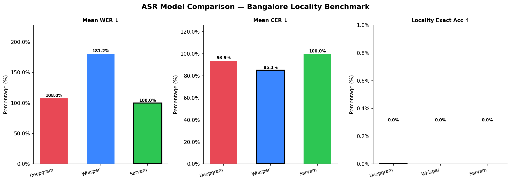
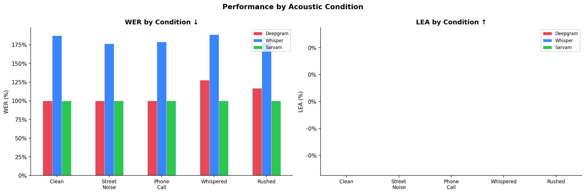
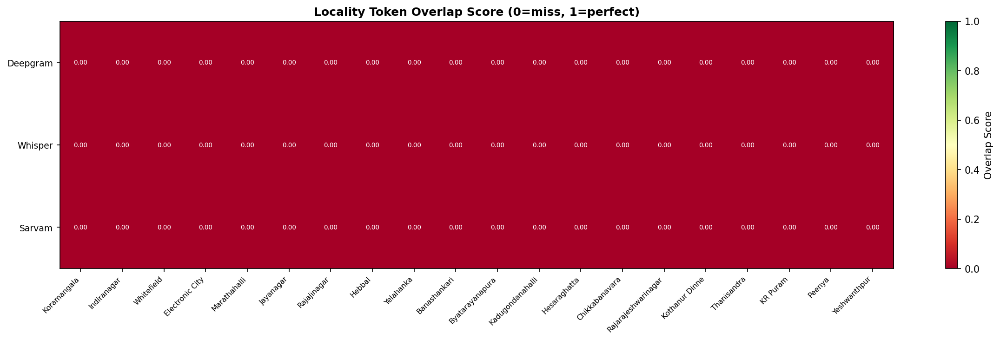
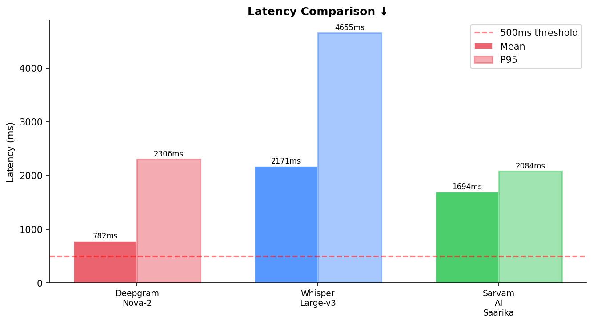
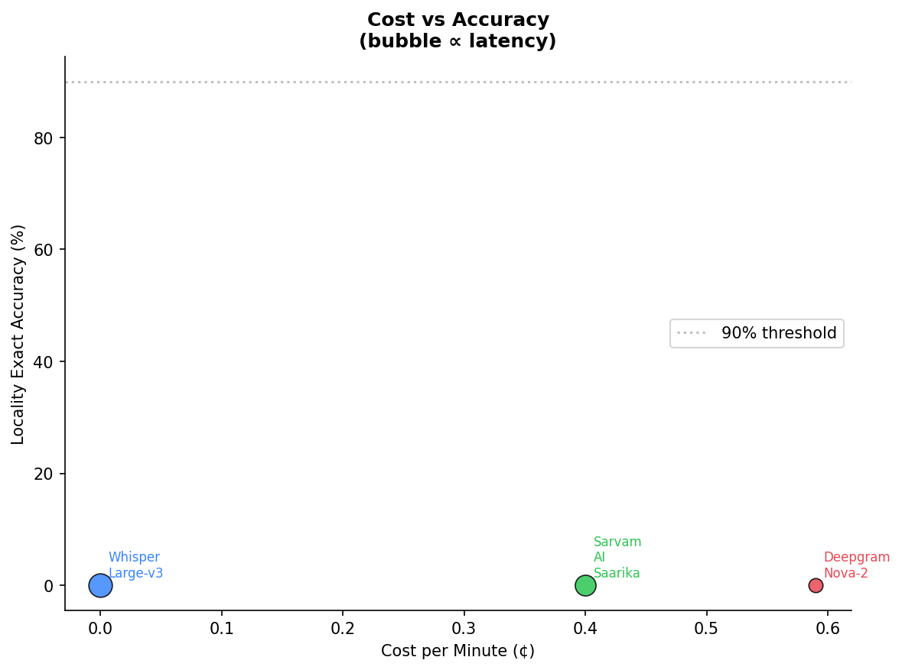

# ASR Shootout — Bangalore Locality Benchmark

A benchmark comparing three speech-to-text models on **Hinglish audio** (Hindi + English code-switching) recorded across real Bangalore locality names. Designed to stress-test ASR systems on the kind of speech that actually happens in Indian ride-hailing, delivery, and navigation apps.

---

## What This Tests

Most ASR benchmarks use clean studio audio with standard vocabulary. This one doesn't. It tests:

- **Hinglish code-switching** — sentences that mix Hindi and English mid-sentence
- **Hyper-local place names** — Bangalore localities like *Byatarayanapura*, *Kadugondanahalli*, *Rajarajeshwarinagar* that no generic model was trained to expect
- **Real acoustic conditions** — clean, street noise, phone call quality, whispered, and rushed speech

The core question: *can these models actually catch the locality name a user says?*

---

## Models Compared

| Model | Type | Cost/min | Streaming |
|---|---|---|---|
| **Deepgram Nova-2** | Cloud API | $0.0059 | Yes |
| **Whisper Large-v3** | Open-source | Free | No |
| **Sarvam AI Saarika** | Cloud API | $0.004 | Yes |

---

## Dataset

**20 audio samples** across 20 Bangalore localities, each spoken under one of five acoustic conditions:

| Condition | Description |
|---|---|
| `clean` | Studio-quality, no noise |
| `street_noise` | Ambient traffic, crowd noise |
| `phone_call` | Compressed, low-bandwidth audio |
| `whispered` | Spoken softly |
| `rushed` | Fast, clipped speech |

**Localities tested:** Koramangala, Indiranagar, Whitefield, Electronic City, Marathahalli, Jayanagar, Rajajinagar, Hebbal, Yelahanka, Banashankari, Byatarayanapura, Kadugondanahalli, Hesaraghatta, Chikkabanavara, Rajarajeshwarinagar, Kothanur Dinne, Thanisandra, KR Puram, Peenya, Yeshwanthpur

### Folder Structure

```
audio_samples/
├── manifest.json          # Ground truth: sentences, localities, conditions
├── sample_01.wav
├── sample_02.wav
└── ...
```

The `manifest.json` contains one entry per sample with fields: `index`, `filename`, `locality`, `condition`, `sentence`.

---

## Metrics

Three metrics are reported:

**WER (Word Error Rate)** — what fraction of words the model got wrong. Lower is better. 0% = perfect, 100% = completely wrong.

**CER (Character Error Rate)** — same idea but at the character level. Catches near-misses that WER misses.

**LEA (Locality Extraction Accuracy)** — the key metric for this benchmark. Did the model correctly capture the locality name the speaker said?
- *Exact* — the locality's words all appear verbatim in the transcript
- *Fuzzy* — the locality appears with ≥60% character similarity (catches minor phonetic drift)

---

## Results

### Overall Comparison



| Model | WER ↓ | CER ↓ | LEA Exact ↑ | LEA Fuzzy ↑ | Mean Latency | Cost/min |
|---|---|---|---|---|---|---|
| Deepgram Nova-2 | 108% | 93.9% | 0% | 5% | 783 ms | $0.0059 |
| Whisper Large-v3 | 181.2% | 85.1% | 0% | 0% | 2,171 ms | Free |
| Sarvam AI Saarika | 100% | 100% | 0% | 0% | 1,695 ms | $0.004 |

*(WER > 100% is possible when the model inserts more words than the reference has)*

### Performance by Acoustic Condition



| Model | Clean | Street Noise | Phone Call | Whispered | Rushed |
|---|---|---|---|---|---|
| Deepgram Nova-2 | 100% WER | 100% WER | 100% WER | 127.5% WER | 116.7% WER |
| Whisper Large-v3 | 187.1% WER | 176.3% WER | 178.9% WER | 188.6% WER | 178.3% WER |
| Sarvam AI Saarika | 100% WER | 100% WER | 100% WER | 100% WER | 100% WER |

### Locality Detection Heatmap



Locality overlap score per sample (0 = complete miss, 1 = perfect). 

### Latency



| Model | Mean Latency | P95 Latency |
|---|---|---|
| Deepgram Nova-2 | 783 ms | 2,306 ms |
| Whisper Large-v3 | 2,171 ms | 4,655 ms |
| Sarvam AI Saarika | 1,695 ms | 2,084 ms |

### Cost vs Accuracy



---

## Setup

### Requirements

```bash
pip install openai-whisper httpx torch
```

### API Keys

Open `asr_shootout.ipynb` and fill in Cell 2 (Configuration):

```python
DEEPGRAM_API_KEY = "your_key_here"
SARVAM_API_KEY   = "your_key_here"
```

Get keys at [deepgram.com](https://deepgram.com) and [sarvam.ai](https://sarvam.ai).

### Run

```bash
jupyter notebook asr_shootout.ipynb
```

Run all cells in order. Results save to `./output/benchmark_results.json` and charts to `./output/output/Charts/`.

---

## Notebook Structure

| Cell | What it does |
|---|---|
| 0 | Install dependencies |
| 1 | Imports |
| 2 | Configuration (API keys, paths) |
| 3 | Metrics functions (WER, CER, LEA) |
| 4 | ASR runners (Deepgram, Whisper, Sarvam) |
| 5 | Load dataset manifest |
| 6 | Run benchmark across all models |
| 7 | Print results tables |
| 8 | Save JSON output |
| 9 | Generate charts |

---

