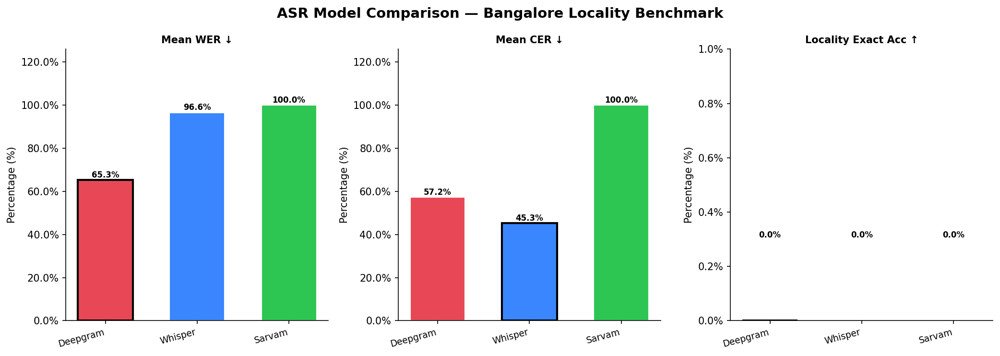
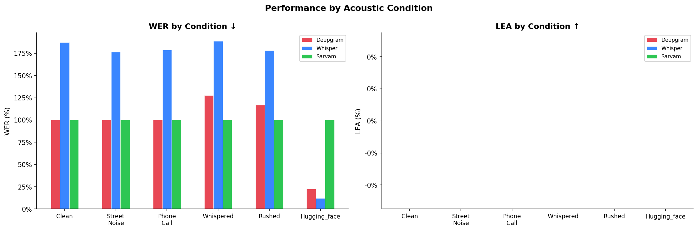
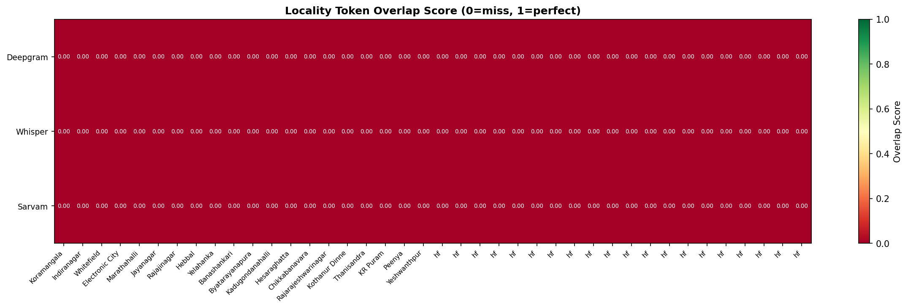
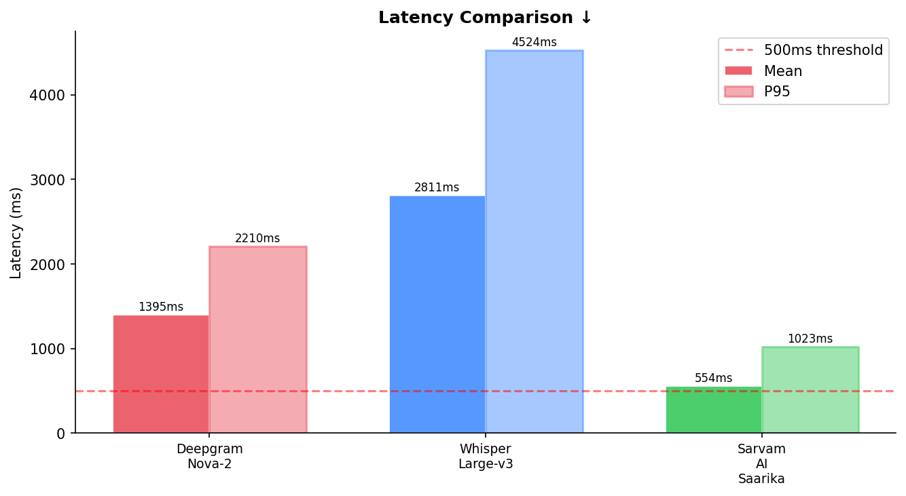
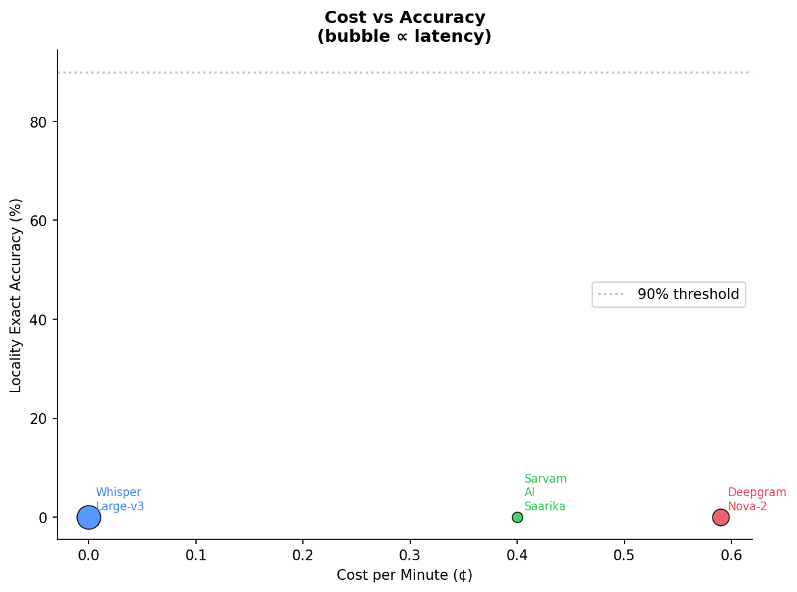

# ASR Shootout — Bangalore Locality Benchmark

A benchmark comparing three speech-to-text models on **Hinglish audio** (Hindi + English code-switching) recorded across real Bangalore locality names — now extended with the **HuggingFace Kambath (AI4Bharat) Hindi dataset** for broader language coverage.

---

## What This Tests

Most ASR benchmarks use clean studio audio with standard vocabulary. This one doesn't. It tests:

- **Hinglish code-switching** — sentences that mix Hindi and English mid-sentence
- **Hyper-local place names** — Bangalore localities like *Byatarayanapura*, *Kadugondanahalli*, *Rajarajeshwarinagar* that no generic model was trained to expect
- **Real acoustic conditions** — clean, street noise, phone call quality, whispered, and rushed speech
- **Hindi-only speech** — 20 samples from the AI4Bharat Kambath dataset via HuggingFace, testing pure Devanagari transcription quality

The core question: *can these models reliably transcribe the locality name a user says — and handle formal Hindi too?*

---

## Models Compared

| Model | Type | Cost/min | Streaming |
|---|---|---|---|
| **Deepgram Nova-2** | Cloud API | $0.0059 | Yes |
| **Whisper Large-v3** | Open-source | Free | No |
| **Sarvam AI Saarika** | Cloud API | $0.004 | Yes |

---

## Dataset

### Original: Custom Bangalore Locality Dataset (20 samples)

**20 audio samples** across 20 Bangalore localities, each spoken under one of five acoustic conditions:

| Condition | Description |
|---|---|
| `clean` | Studio-quality, no noise |
| `street_noise` | Ambient traffic, crowd noise |
| `phone_call` | Compressed, low-bandwidth audio |
| `whispered` | Spoken softly |
| `rushed` | Fast, clipped speech |

**Localities tested:** Koramangala, Indiranagar, Whitefield, Electronic City, Marathahalli, Jayanagar, Rajajinagar, Hebbal, Yelahanka, Banashankari, Byatarayanapura, Kadugondanahalli, Hesaraghatta, Chikkabanavara, Rajarajeshwarinagar, Kothanur Dinne, Thanisandra, KR Puram, Peenya, Yeshwanthpur

### Extended: HuggingFace Kambath Dataset (20 samples)

**20 Hindi speech samples** sourced from the [AI4Bharat Kambath dataset](https://huggingface.co/datasets/ai4bharat/Kambath) via HuggingFace. These samples test formal Devanagari Hindi transcription — distinct from the Hinglish code-switched locality utterances.

- **Language:** Hindi (Devanagari script references)
- **Condition label:** `Hugging_face`
- **Purpose:** Evaluate how well each model handles pure Hindi without Romanisation

**Total dataset: 40 samples** across all conditions.

### Folder Structure

```
audio_samples/
├── manifest.json          # Ground truth: sentences, localities, conditions
├── 01_Koramangala_clean.wav
├── ...
└── (HuggingFace samples saved as XX_hf.wav)

output_with_kambath/
├── benchmark_results.json  # Full results across all 40 samples
└── Charts/
    ├── overall_comparison.png
    ├── condition_breakdown.png
    ├── lea_heatmap.png
    ├── latency_comparison.png
    └── cost_vs_accuracy.png
```

The `manifest.json` contains one entry per sample with fields: `index`, `filename`, `locality`, `condition`, `sentence`.

---

## Metrics

Three metrics are reported:

**WER (Word Error Rate)** — what fraction of words the model got wrong. Lower is better. 0% = perfect, 100% = completely wrong.

**CER (Character Error Rate)** — same idea but at the character level. Catches near-misses that WER misses.

**LEA (Locality Extraction Accuracy)** — the key metric for this benchmark. Did the model correctly capture the locality name the speaker said?
- *Exact* — the locality's words all appear verbatim in the transcript
- *Fuzzy* — the locality appears with ≥60% character similarity (catches minor phonetic drift)

---

## Results (40 Samples — including Kambath)

### Overall Comparison



| Model | WER ↓ | CER ↓ | LEA Exact ↑ | LEA Fuzzy ↑ | Mean Latency | Cost/min |
|---|---|---|---|---|---|---|
| Deepgram Nova-2 | 65.3% | 57.2% | 0% | 2.5% | 1,395 ms | $0.0059 |
| Whisper Large-v3 | 96.6% | 45.3% | 0% | 0% | 2,811 ms | Free |
| Sarvam AI Saarika | 100% | 100% | 0% | 0% | 554 ms | $0.004 |

*(WER > 100% is possible when the model inserts more words than the reference has)*

### Performance by Acoustic Condition



| Model | Clean | Street Noise | Phone Call | Whispered | Rushed | HuggingFace (Hindi) |
|---|---|---|---|---|---|---|
| Deepgram Nova-2 | 100% WER | 100% WER | 100% WER | 127.5% WER | 116.7% WER | **22.7% WER** |
| Whisper Large-v3 | 187.1% WER | 176.3% WER | 178.9% WER | 188.6% WER | 178.3% WER | **12.0% WER** |
| Sarvam AI Saarika | 100% WER | 100% WER | 100% WER | 100% WER | 100% WER | 100% WER |

**Key finding:** Whisper Large-v3 excels on standard Hindi (12% WER on Kambath samples), and Deepgram performs surprisingly well too (22.7% WER). Sarvam AI produced no output on the HuggingFace samples in this run (100% WER = empty transcripts).

### Locality Detection Heatmap



Locality overlap score per sample (0 = complete miss, 1 = perfect).

### Latency



| Model | Mean Latency | P95 Latency |
|---|---|---|
| Deepgram Nova-2 | 1,395 ms | 2,210 ms |
| Whisper Large-v3 | 2,811 ms | 4,524 ms |
| Sarvam AI Saarika | 554 ms | 1,023 ms |

### Cost vs Accuracy



---

## Setup

### Requirements

```bash
pip install openai-whisper httpx torch datasets huggingface_hub soundfile
```

Or via requirements.txt:

```bash
pip install -r requirements.txt
```

### API Keys

Open `asr_shootout_with_kambath.ipynb` and fill in Cell 2 (Configuration):

```python
DEEPGRAM_API_KEY = "your_key_here"
SARVAM_API_KEY   = "your_key_here"
HF_TOKEN         = "your_huggingface_token"   # for AI4Bharat Kambath dataset
```

Get keys at [deepgram.com](https://deepgram.com), [sarvam.ai](https://sarvam.ai), and [huggingface.co/settings/tokens](https://huggingface.co/settings/tokens).

### Run

```bash
# Original benchmark (20 samples, no Kambath)
jupyter notebook asr_shootout.ipynb

# Extended benchmark with Kambath (40 samples)
jupyter notebook asr_shootout_with_kambath.ipynb
```

Run all cells in order. Results save to `./output_with_kambath/benchmark_results.json` and charts to `./output_with_kambath/Charts/`.

---

## Notebook Structure

### `asr_shootout_with_kambath.ipynb` (Extended)

| Cell | What it does |
|---|---|
| 0 | Install dependencies |
| 1 | Imports (includes `datasets`, `huggingface_hub`, `soundfile`) |
| 2 | Configuration (API keys, HF token, paths) |
| 3 | Metrics functions (WER, CER, LEA) |
| 4 | ASR runners (Deepgram, Whisper, Sarvam) |
| 5 | Load original Bangalore locality manifest |
| 6 | **(New)** Load HuggingFace Kambath dataset from AI4Bharat |
| 7 | **(New)** Save Kambath samples to audio_samples/ and extend manifest |
| 8 | Run benchmark across all models and all 40 samples |
| 9 | Print results tables (including Kambath condition breakdown) |
| 10 | Save JSON output to `output_with_kambath/` |
| 11 | Generate charts |

---
